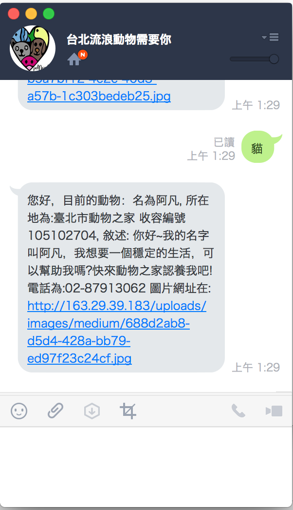

流浪動物領養 Line 機器人: 透過 Line 可以查看目前流浪動物收容所的動物資料．
==============

   

透過 Line 來查看台北市目前有哪些流浪動物需要領養？ 請用你的  QR Code 掃描並且加入為好友．

主要功能:
=============

目前僅僅支援顯示台北市流浪動物資料，並且顯示該動物圖片．

歡迎各位建議任何新的功能．

資料來源:
=============

[「臺北市開放認養動物」API存取](http://data.taipei/opendata/datalist/datasetMeta/outboundDesc?id=6a3e862a-e1cb-4e44-b989-d35609559463&rid=f4a75ba9-7721-4363-884d-c3820b0b917c)

意見與建議
=============

歡迎到 [issue](https://github.com/kkdai/LineBotTaipeiPets/issues) 寫下你的意見，或是一起來幫助我．

想要自己架設一個 Line 機器人?
=============

參考我的[教學文章([Golang][教學] 在 Heroku 建立你自己的 Line 機器人 (Line Bot API))](http://www.evanlin.com/create-your-line-bot-golang/)，或是[教學 Github ](https://github.com/kkdai/LineBotTemplate)

Inspired By
=============

- [Golang (heroku) で LINE Bot 作ってみる](http://qiita.com/dongri/items/ba150f04a98e96b160e7)
- [LINE BOT をとりあえずタダで Heroku で動かす](http://qiita.com/yuya_takeyama/items/0660a59d13e2cd0b2516)
- [petneed.me](https://github.com/jsleetw/petneed.me)

Project52
---------------

It is one of my [project 52](https://github.com/kkdai/project52).

致謝
---------------

感謝[g0v](http://g0v.tw/)的許多人不斷地提起這個專案，讓我可以注意到並且能夠一起幫忙．

- [Hackpad: Petneedme](https://g0v.hackpad.com/ep/pad/static/GOdHRgQpZSL)
- [Hackpad: 公立動物收容所資訊統整系統](https://g0v.hackpad.com/ep/pad/static/JBhVDOPxhxe) ([active one](https://g0v.hackpad.com/JBhVDOPxhxe))

License
---------------

Licensed under the Apache License, Version 2.0 (the "License");
you may not use this file except in compliance with the License.
You may obtain a copy of the License at

http://www.apache.org/licenses/LICENSE-2.0

Unless required by applicable law or agreed to in writing, software
distributed under the License is distributed on an "AS IS" BASIS,
WITHOUT WARRANTIES OR CONDITIONS OF ANY KIND, either express or implied.
See the License for the specific language governing permissions and
limitations under the License.

